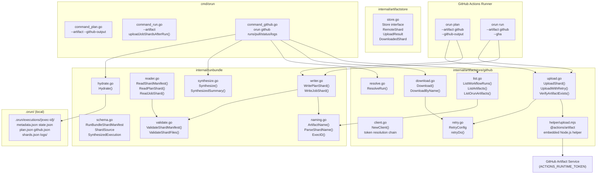
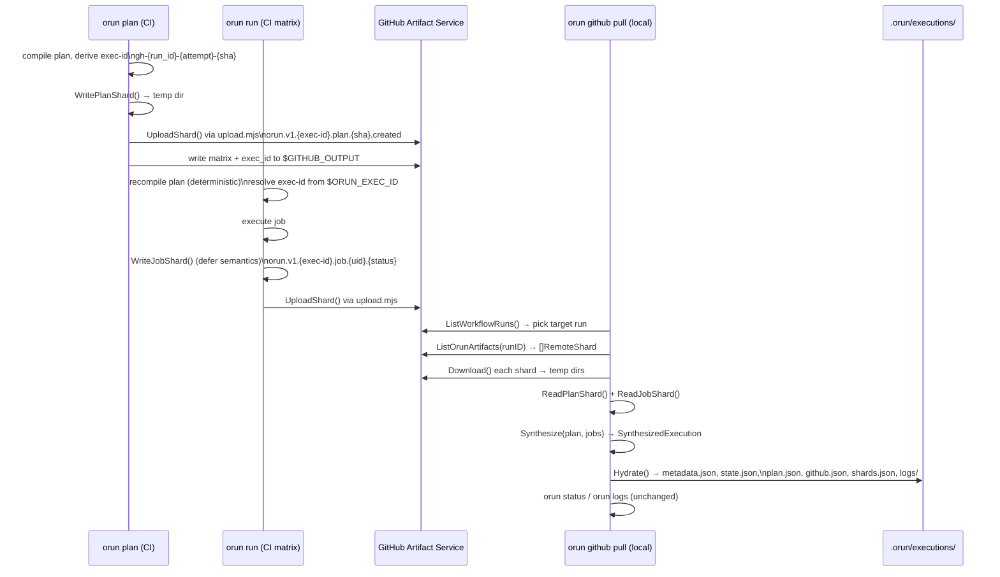
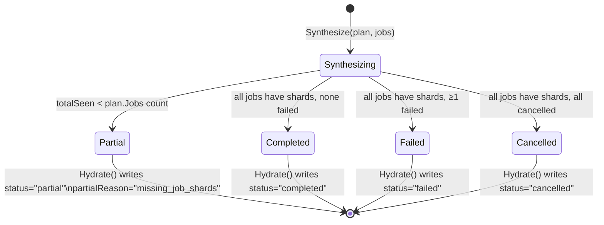

# Design Document: GitHub Artifacts

## Overview

Orun produces immutable GitHub Actions artifact shards from CI execution — plan evidence, job results, and step logs — without requiring `actions/upload-artifact` steps in workflow YAML. Each Orun invocation uploads exactly one shard. Local `orun github pull` performs lazy fan-in, synthesizes execution state, and hydrates the standard `.orun/executions/` layout so that `orun status` and `orun logs` work unchanged.

The design separates three concerns: the portable **RunBundle shard format** (owned by Orun, backend-agnostic), the **GitHub artifact store** (first storage backend), and the **CLI commands** that drive plan, run, and local inspection. This separation means the same shard format will work with future R2, S3, or Orun Cloud backends.

The feature is largely implemented. This document records what exists, what still needs work, and provides a verification step for each phase so the team can confirm current state before starting any remaining work.

---

## High-Level Design

### Component Diagram




### Data Flow




### Three-Level Artifact Detail Model

Remote inspection operates at three levels of cost and fidelity:

| Level | Command | Network cost | What is downloaded | Accuracy |
|-------|---------|-------------|-------------------|----------|
| 1 | `orun github runs` | Artifact list API only | Nothing — names parsed in memory | Approximate (name-encoded status) |
| 2 | `orun github runs --details` | Manifest files only | `manifest.json` per shard | Exact status, no logs |
| 3 | `orun github pull` | Full shard ZIPs | All files including logs | Full hydration |

Level 1 is always fast. Level 2 requires downloading one small JSON per shard. Level 3 is the full fan-in path.

**Level 2 is not yet implemented.** The `--details` flag is registered but `runGithubRuns()` does not download manifests. See Phase 9 gap below.

### Artifact Naming Convention

```
orun.v1.<exec-id>.<role>.<suffix>.<status>
```

Examples:
```
orun.v1.gh-26185145757-1-a1b2c3d4.plan.a1b2c3d4.created
orun.v1.gh-26185145757-1-a1b2c3d4.job.7f6a9c21d4e8b012.failed
```

Exec-ID format: `gh-{GITHUB_RUN_ID}-{GITHUB_RUN_ATTEMPT}-{plan_short_sha}`

All components are constrained to `[a-zA-Z0-9_-]+` for safe use in artifact names and file paths.

### Token Resolution Chain

```
1. GITHUB_TOKEN env var
2. GH_TOKEN env var
3. gh auth token (subprocess)
4. Explicit --token flag (ClientOption)
```

Implemented in `internal/artifactstore/github/client.go:resolveToken()`.

For private repos, the token needs `Actions: read` fine-grained permission for artifact listing and download.

---

## Low-Level Design

### Phase 1 — RunBundle Schema

Defines the portable shard format. All fields are backend-agnostic.

**Key types** (`internal/runbundle/schema.go`):

```go
type RunBundleShardManifest struct {
    APIVersion    string            // "orun.io/v1alpha1"
    Kind          string            // "RunBundleShard"
    SchemaVersion string            // "1.0.0"
    Role          ShardRole         // "plan" | "job"
    ExecID        string            // gh-{run_id}-{attempt}-{sha}
    PlanID        string            // plan short checksum
    JobUID        string            // stable job UID (job shards only)
    JobID         string            // human-readable job ID
    Component     string
    Environment   string
    Status        string            // terminal status
    StartedAt     string            // RFC3339
    FinishedAt    string            // RFC3339
    Source        ShardSource       // provenance
    Files         map[string]string // logical name → relative path
}

type ShardSource struct {
    Type       string // "github-actions" | "local" | "r2" | "s3"
    Repository string
    RunID      string
    RunAttempt string
    Workflow   string
    SHA        string
    Ref        string
    EventName  string
}
```

**Shard file layouts:**

Plan shard:
```
manifest.json   checksums.json   plan.json
trigger.json    git.json
```

Job shard:
```
manifest.json   checksums.json   job.json
state.json      steps.jsonl      logs/<step-id>.log
```

### Current Implementation Status — Phase 1

**Files:** `internal/runbundle/schema.go`, `internal/runbundle/naming.go`

| Item | Status |
|------|--------|
| `RunBundleShardManifest` struct | ✅ DONE |
| `ShardSource` struct | ✅ DONE |
| `SynthesizedExecution`, `JobCounts`, `JobShardRef` | ✅ DONE |
| `ArtifactName()`, `ParseShardName()`, `ExecID()` | ✅ DONE |
| `ValidExecID()`, `IsOrunArtifact()` | ✅ DONE |

**Verify:**
```bash
go test ./internal/runbundle/ -run TestNaming -v
go test ./internal/runbundle/ -run TestSchema -v
```

---

### Phase 2 — Shard Writer and Reader

Writes and reads shard directories on disk. Checksums are computed over all tracked files (excluding `checksums.json` itself).

**Writer API** (`internal/runbundle/writer.go`):

```go
func WritePlanShard(ctx context.Context, opts WritePlanShardOptions) (*Shard, error)
func WriteJobShard(ctx context.Context, opts WriteJobShardOptions) (*Shard, error)
```

`WriteJobShard` copies step logs from the execution log directory into `logs/` and records each log file in `manifest.Files` under the `log:<step-id>` key.

**Reader API** (`internal/runbundle/reader.go`):

```go
func ReadShardManifest(dir string) (*RunBundleShardManifest, error)
func ReadPlanShard(dir string) (*PlanShard, error)
func ReadJobShard(dir string) (*JobShard, error)
```

`ReadShardManifest` calls `ValidateShardManifest` and `ValidateShardFiles` before returning.

**Validation** (`internal/runbundle/validate.go`):

- Schema version must be in `supportedSchemaVersions`
- All files listed in `manifest.Files` must exist
- Path traversal rejected via `filepath.Abs` prefix check
- SHA-256 checksums verified against `checksums.json`

### Current Implementation Status — Phase 2

**Files:** `internal/runbundle/writer.go`, `internal/runbundle/reader.go`, `internal/runbundle/validate.go`

| Item | Status |
|------|--------|
| `WritePlanShard()` | ✅ DONE |
| `WriteJobShard()` with log copy | ✅ DONE |
| `ReadShardManifest()` with validation | ✅ DONE |
| `ReadPlanShard()`, `ReadJobShard()` | ✅ DONE |
| Checksum computation and verification | ✅ DONE |
| Path traversal defense | ✅ DONE |

**Verify:**
```bash
go test ./internal/runbundle/ -run TestWriter -v
go test ./internal/runbundle/ -run TestReader -v
go test ./internal/runbundle/ -run TestValidate -v
```

---

### Phase 3 — Generic Artifact Store Interface

Defines the backend-agnostic contract. GitHub is the first implementation; R2, S3, and Orun Cloud are future backends.

**Interface** (`internal/artifactstore/store.go`):

```go
type Store interface {
    Upload(ctx context.Context, shard *runbundle.Shard) (*UploadResult, error)
    List(ctx context.Context, opts ListOptions) ([]RemoteShard, error)
    Download(ctx context.Context, shard RemoteShard, destDir string) (*DownloadedShard, error)
}

type RemoteShard struct {
    Name       string
    ID         string
    SizeBytes  int64
    CreatedAt  time.Time
    ExpiresAt  time.Time
    Parsed     *runbundle.ParsedShardName  // nil if not an Orun artifact
    SourceMeta map[string]string
}

type UploadResult struct {
    ID     string
    Name   string
    Size   int64
    Digest string
}

type DownloadedShard struct {
    Name  string
    Dir   string
    Shard *runbundle.RunBundleShardManifest
}
```

### Current Implementation Status — Phase 3

**Files:** `internal/artifactstore/store.go`

| Item | Status |
|------|--------|
| `Store` interface | ✅ DONE |
| `RemoteShard`, `UploadResult`, `DownloadedShard` | ✅ DONE |
| `ListOptions` | ✅ DONE |
| `memory.go` / `local.go` test implementations | ⚠️ NEEDS WORK — not present; tests use mocks inline |

**Verify:**
```bash
# Interface compiles correctly
go build ./internal/artifactstore/...
```

---

### Phase 4 — GitHub Artifact Store: List and Download

**Client** (`internal/artifactstore/github/client.go`):

Token resolution runs in `NewClient()`. The client supports `WithToken`, `WithBaseURL` (for GHES), `WithHTTPClient`, and `WithRetryConfig` options.

**List** (`internal/artifactstore/github/list.go`):

```go
func (c *Client) ListWorkflowRuns(ctx context.Context, opts ListRunOptions) ([]WorkflowRun, error)
func (c *Client) ListArtifacts(ctx context.Context, runID int64) ([]artifactstore.RemoteShard, error)
func (c *Client) ListOrunArtifacts(ctx context.Context, runID int64) ([]artifactstore.RemoteShard, error)
```

`ListArtifacts` calls `runbundle.ParseShardName` on each artifact name. `ListOrunArtifacts` filters to only those where `Parsed != nil`.

**Download** (`internal/artifactstore/github/download.go`):

```go
func (c *Client) Download(ctx context.Context, shard artifactstore.RemoteShard, destDir string) (*artifactstore.DownloadedShard, error)
func (c *Client) DownloadByName(ctx context.Context, runID int64, name, destDir string) (*artifactstore.DownloadedShard, error)
```

Downloads the artifact ZIP via `GET /repos/{owner}/{repo}/actions/artifacts/{id}/zip`, extracts with path traversal defense, then calls `ReadShardManifest` on the extracted directory.

**Resolve** (`internal/artifactstore/github/resolve.go`):

```go
func ResolveRun(ctx context.Context, c *Client, opts ResolveOpts) (*WorkflowRun, error)
```

Resolution priority: explicit `RunID` → parse `ExecID` → `SHA` → `Failed` → latest.

**Retry** (`internal/artifactstore/github/retry.go`):

All HTTP calls go through `retryDo()` with exponential backoff + jitter. Default: 3 retries, 500ms initial delay, 10s max, retryable on 429/5xx and network errors.

### Current Implementation Status — Phase 4

**Files:** `client.go`, `list.go`, `download.go`, `resolve.go`, `retry.go`

| Item | Status |
|------|--------|
| `NewClient()` with token resolution chain | ✅ DONE |
| `ListWorkflowRuns()` with filters | ✅ DONE |
| `ListArtifacts()` / `ListOrunArtifacts()` | ✅ DONE |
| `Download()` with ZIP extraction + path traversal defense | ✅ DONE |
| `ResolveRun()` with all resolution modes | ✅ DONE |
| `retryDo()` with exponential backoff + jitter | ✅ DONE |
| GHES support via `WithBaseURL` | ✅ DONE |

**Verify:**
```bash
go test ./internal/artifactstore/github/ -run TestList -v
go test ./internal/artifactstore/github/ -run TestDownload -v
go test ./internal/artifactstore/github/ -run TestRetry -v
go test ./internal/artifactstore/github/ -v
```

---

### Phase 5 — GitHub Artifact Upload via Embedded Helper

Upload uses the official `@actions/artifact` Node.js package via an embedded helper. This avoids depending on undocumented GitHub internal wire protocol.

**Upload flow** (`internal/artifactstore/github/upload.go`):

```go
func (c *Client) UploadShard(ctx context.Context, shard *runbundle.Shard) (*artifactstore.UploadResult, error)
func (c *Client) UploadWithRetry(ctx context.Context, shard *runbundle.Shard) (*artifactstore.UploadResult, error)
func (c *Client) Upload(ctx context.Context, shard *runbundle.Shard) (*artifactstore.UploadResult, error)
func (c *Client) VerifyArtifactExists(ctx context.Context, runID int64, name string) error
```

`UploadShard` is the primary entry point. When `GITHUB_ACTIONS=true` and `ACTIONS_RUNTIME_TOKEN` is set, it calls `UploadWithRetry` then `VerifyArtifactExists`. Otherwise it falls through to `uploadViaAPI` which returns a descriptive error.

**Embedded helper** (`helper/upload.mjs`, `helper/package.json`):

The helper is embedded via `//go:embed` directives. On first use, `ensureHelperExtracted()` writes the files to a temp directory and runs `npm install`. The helper accepts `<shardDir> <artifactName> [retentionDays]` and prints a JSON result: `{"id":"...","name":"...","size":...}`.

**Guardrails:**
- Only runs inside GitHub Actions (`GITHUB_ACTIONS=true`)
- Requires `ACTIONS_RUNTIME_TOKEN`
- One artifact per Orun invocation (enforced by naming — same exec-id + role + suffix = same name)
- Retention days from `ORUN_ARTIFACT_RETENTION_DAYS` env var, default 14

### Current Implementation Status — Phase 5

**Files:** `upload.go`, `helper/upload.mjs`, `helper/package.json`

| Item | Status |
|------|--------|
| `Upload()` via embedded Node.js helper | ✅ DONE |
| `UploadWithRetry()` with retry logic | ✅ DONE |
| `UploadShard()` orchestrator with verification | ✅ DONE |
| `VerifyArtifactExists()` with polling | ✅ DONE |
| `PackageShardAsZip()` utility | ✅ DONE |
| `ensureHelperExtracted()` with npm install | ✅ DONE |
| `helper/upload.mjs` using `@actions/artifact` | ✅ DONE |
| Retention days from env var | ✅ DONE |

**Verify:**
```bash
go test ./internal/artifactstore/github/ -run TestUpload -v
# For real upload test, requires GitHub Actions environment
```

---

### Phase 6 — `orun plan` Integration

**Flags** (`cmd/orun/command_plan.go`):

```
--artifact github      Select GitHub artifact backend
--github-output        Write matrix/plan_id/exec_id to $GITHUB_OUTPUT
```

**Behavior** (`cmd/orun/main.go:generatePlan()`):

When `--artifact github` and `GITHUB_ACTIONS=true`:
1. Derive exec-id: `runbundle.ExecID(GITHUB_RUN_ID, GITHUB_RUN_ATTEMPT, planShortSHA)`
2. Build `ShardSource` from GitHub env vars
3. `WritePlanShard()` to temp directory
4. `ghClient.UploadShard()` — warns on failure, does not abort
5. If `--github-output` and `$GITHUB_OUTPUT` is set: write `matrix`, `plan_id`, `exec_id` in multiline format

**Matrix output format:**
```
matrix<<EOF
{"include":[{"id":"...","uid":"...","component":"...","env":"...","composition":"...","profile":"..."},...]}
EOF
plan_id=a1b2c3d4
exec_id=gh-26185145757-1-a1b2c3d4
```

### Current Implementation Status — Phase 6

**Files:** `cmd/orun/command_plan.go`, `cmd/orun/main.go`

| Item | Status |
|------|--------|
| `--artifact` flag registered | ✅ DONE |
| `--github-output` flag registered | ✅ DONE |
| Exec-id derivation from GitHub env vars | ✅ DONE |
| `WritePlanShard()` + `UploadShard()` in `generatePlan()` | ✅ DONE |
| `$GITHUB_OUTPUT` write with matrix + plan_id + exec_id | ✅ DONE |
| Upload failure is warn-only (does not abort plan) | ✅ DONE |

**Verify:**
```bash
go test ./cmd/orun/ -run TestPlan -v
# Check flag registration:
go run ./cmd/orun plan --help | grep -E 'artifact|github-output'
```

---

### Phase 7 — `orun run` Integration

**Flag** (`cmd/orun/command_run.go`):

```
--artifact github      Upload job shard after run completes
```

**Behavior** (`cmd/orun/command_run.go:runPlan()`):

After `r.Run(plan)` returns (success or failure), `uploadJobShardsAfterRun()` is called when `--artifact github` and `GITHUB_ACTIONS=true`. This runs under defer-equivalent semantics — the original exit code is preserved regardless of upload outcome.

**`uploadJobShardsAfterRun()` flow:**

```
for each terminal job in execState.Jobs:
    skip if status is "" | "running" | "pending"
    WriteJobShard() → temp dir
    ghClient.UploadShard()
    os.RemoveAll(temp dir)
    warn on error, continue
```

**Critical design rule:** Job shard upload must not change the job's exit code. A failed upload prints a warning to stderr and returns. The runner's exit code is the source of truth for CI pass/fail.

**Plan recompilation on matrix runners:**

Matrix jobs run on fresh machines without `.orun/plans/latest.json`. The current implementation passes `--exec-id "$ORUN_EXEC_ID"` and `--job "$ORUN_JOB_ID"` from the plan job's outputs. The plan is recompiled deterministically in each matrix job — same inputs produce the same plan checksum.

### Current Implementation Status — Phase 7

**Files:** `cmd/orun/command_run.go`

| Item | Status |
|------|--------|
| `--artifact` flag registered | ✅ DONE |
| `uploadJobShardsAfterRun()` called after `r.Run()` | ✅ DONE |
| Defer semantics (upload after success or failure) | ✅ DONE |
| Upload failure is warn-only | ✅ DONE |
| `WriteJobShard()` with log copy | ✅ DONE |
| Temp dir cleanup after upload | ✅ DONE |
| `--exec-id` flag for matrix job exec-id propagation | ✅ DONE |

**Verify:**
```bash
go test ./cmd/orun/ -run TestRun -v
# Check flag registration:
go run ./cmd/orun run --help | grep artifact
```

---

### Phase 8 — Synthesis and Hydration

**Synthesize** (`internal/runbundle/synthesize.go`):

```go
func Synthesize(plan *PlanShard, jobs []*JobShard) (*SynthesizedExecution, error)
```

Merges one plan shard and N job shards. Jobs are matched by `JobUID` first, then by `JobID`. Jobs in the plan with no matching shard get `status: "pending"` and increment `Counts.Pending`. The overall status is computed from counts:

```
partial    → totalSeen < total
failed     → any failed
cancelled  → all cancelled, none completed
completed  → all accounted for, none failed
```

**Partial hydration state machine:**



**Hydrate** (`internal/runbundle/hydrate.go`):

```go
func Hydrate(ctx context.Context, planShard *PlanShard, jobShards []*JobShard,
    opts HydrateOptions, orunDir string) (*HydrateResult, error)
```

Writes the standard `.orun/executions/{exec-id}/` layout using `state.Store` types for compatibility with `orun status` and `orun logs`:

```
.orun/executions/{exec-id}/
    metadata.json    ← state.ExecMetadata
    state.json       ← state.ExecState (jobs map)
    plan.json        ← copy of plan
    github.json      ← ShardSource provenance
    shards.json      ← shard name references
    logs/
        {job-id}/
            {step-id}.log
executions/latest    ← symlink to exec-id
```

**Partial display in `orun status`:**

`SynthesizedSummary()` returns `"partial  14/18 shards"`. The `orun status` command reads `metadata.json` which has `Status: "partial"`. The display format `◐ partial  14/18 shards` requires verification — see gap below.

### Current Implementation Status — Phase 8

**Files:** `internal/runbundle/synthesize.go`, `internal/runbundle/hydrate.go`

| Item | Status |
|------|--------|
| `Synthesize()` with plan/job matching | ✅ DONE |
| Partial status when shards missing | ✅ DONE |
| `SynthesizedSummary()` / `SynthesizedStatus()` | ✅ DONE |
| `Hydrate()` writing `state.ExecMetadata` + `state.ExecState` | ✅ DONE |
| Log copy from job shards | ✅ DONE |
| `latest` symlink update | ✅ DONE |
| `orun status` displays `◐ partial  N/M shards` format | ⚠️ NEEDS VERIFICATION — `metadata.json` has `Status: "partial"` but display format needs manual check |

**Verify:**
```bash
go test ./internal/runbundle/ -run TestSynthesize -v
go test ./internal/runbundle/ -run TestHydrate -v
# After orun github pull, check:
cat .orun/executions/latest/metadata.json | jq .status
orun status
```

---

### Phase 9 — CLI: `orun github` Commands

All four subcommands are registered under `orun github` in `cmd/orun/command_github.go`.

#### `orun github runs`

Lists workflow runs. For each run, calls `ListArtifacts` and filters to Orun shards. Displays run ID, short SHA, branch, status, age, and shard count.

**Gap — `--details` (Level 2) not implemented:**

The `--details` flag is registered but `runGithubRuns()` does not download manifests. The intended behavior:

```go
// When --details is set, for each Orun shard:
// 1. Download only manifest.json (not the full ZIP)
// 2. Parse RunBundleShardManifest
// 3. Display exact status from manifest.Status
```

The GitHub API does not support partial ZIP extraction. The options are:
- Download the full ZIP and read only `manifest.json` (simplest, acceptable for small shards)
- Add a `DownloadManifestOnly(ctx, shard, destDir)` helper that downloads and reads only the manifest file

**Recommended interface for the gap:**

```go
// DownloadManifest downloads a shard ZIP and returns only the manifest.
// The full ZIP is discarded after manifest extraction.
func (c *Client) DownloadManifest(ctx context.Context, shard artifactstore.RemoteShard) (*runbundle.RunBundleShardManifest, error)
```

#### `orun github pull`

Full fan-in path. Resolves run → lists Orun shards → downloads all → synthesizes → hydrates. Implemented and functional.

#### `orun github status`

Lightweight: lists artifacts, groups by exec-id, shows plan/job counts. Does not download anything. Implemented.

#### `orun github logs`

**Gap — prints file names, not content:**

Current implementation downloads the shard ZIP and prints `manifest.Files` keys (logical names). It does not read or print the actual log file content.

The fix is to read each `log:*` file from the extracted shard directory and print it to stdout:

```go
// After downloading shard to ds.Dir:
for logical, relPath := range ds.Shard.Files {
    if !strings.HasPrefix(logical, "log:") {
        continue
    }
    logPath := filepath.Join(ds.Dir, relPath)
    content, err := os.ReadFile(logPath)
    if err != nil {
        fmt.Fprintf(os.Stderr, "⚠ warning: %v\n", err)
        continue
    }
    stepID := strings.TrimPrefix(logical, "log:")
    fmt.Printf("=== %s / %s ===\n%s\n", s.Name, stepID, content)
}
```

### Current Implementation Status — Phase 9

**Files:** `cmd/orun/command_github.go`

| Item | Status |
|------|--------|
| `orun github runs` — Level 1 listing | ✅ DONE |
| `orun github runs --details` — Level 2 manifest download | ⚠️ NEEDS WORK — flag registered, not implemented |
| `orun github pull` — full fan-in + hydration | ✅ DONE |
| `orun github status` — lightweight shard count | ✅ DONE |
| `orun github logs` — download + print log content | ⚠️ NEEDS WORK — prints file names only, not content |
| `orun github pull --latest` / `--failed` / `--exec-id` | ✅ DONE |
| `orun github logs --job` filter | ✅ DONE (filter by name substring) |

**Verify:**
```bash
go run ./cmd/orun github --help
go run ./cmd/orun github runs --help
go run ./cmd/orun github logs --help
# Check --details flag exists:
go run ./cmd/orun github runs --help | grep details
# Confirm logs gap (should print file names, not content):
# orun github logs --latest 2>&1 | head -20
```

---

### Phase 10 — Workflow Template

The canonical workflow template lives at `docs/examples/github-artifacts-workflow.yaml`. There is no `.github/workflows/orun.yaml` template in the repository root.

**Existing template** (`docs/examples/github-artifacts-workflow.yaml`):

```yaml
name: orun
on:
  pull_request:
  push:
    branches: [main]

permissions:
  contents: read
  actions: write    # required for artifact upload

jobs:
  plan:
    runs-on: ubuntu-latest
    outputs:
      matrix: ${{ steps.plan.outputs.matrix }}
      exec_id: ${{ steps.plan.outputs.exec_id }}
    steps:
      - uses: actions/checkout@v4
      - uses: actions/setup-go@v5
        with:
          go-version-file: go.mod
      - name: Build orun
        run: go build -o /usr/local/bin/orun ./cmd/orun
      - name: Plan
        id: plan
        env:
          ORUN_ARTIFACT_BACKEND: github
          ORUN_ARTIFACT_UPLOAD: "true"
        run: |
          orun plan \
            --from-ci github \
            --event-file "$GITHUB_EVENT_PATH" \
            --artifact github \
            --github-output

  run:
    needs: plan
    if: needs.plan.outputs.matrix != '[]'
    strategy:
      fail-fast: false
      matrix:
        job: ${{ fromJson(needs.plan.outputs.matrix) }}
    runs-on: ubuntu-latest
    steps:
      - uses: actions/checkout@v4
      - uses: actions/setup-go@v5
        with:
          go-version-file: go.mod
      - name: Build orun
        run: go build -o /usr/local/bin/orun ./cmd/orun
      - name: Run
        env:
          ORUN_EXEC_ID: ${{ needs.plan.outputs.exec_id }}
          ORUN_JOB_ID: ${{ matrix.job.id }}
          ORUN_ARTIFACT_BACKEND: github
          ORUN_ARTIFACT_UPLOAD: "true"
        run: |
          orun run \
            --from-ci github \
            --event-file "$GITHUB_EVENT_PATH" \
            --exec-id "$ORUN_EXEC_ID" \
            --job "$ORUN_JOB_ID" \
            --artifact github \
            --gha
```

**Gap — no `.github/workflows/orun.yaml` in repo root:**

The design calls for a starter template that users can copy into their own repos. The `docs/examples/` file serves this purpose but is not surfaced as a first-class template. The gap is whether to add a `orun init --workflow` command or simply document the copy step.

**Note on `actions: write` vs `actions: read`:**

Upload requires `actions: write`. Local pull (download) requires only `actions: read`. The template uses `actions: write` which covers both.

### Current Implementation Status — Phase 10

| Item | Status |
|------|--------|
| `docs/examples/github-artifacts-workflow.yaml` | ✅ DONE |
| `.github/workflows/orun.yaml` in repo root | ⚠️ NEEDS WORK — does not exist |
| `orun init --workflow` command or copy instructions | ⚠️ NEEDS WORK — not implemented |

**Verify:**
```bash
ls .github/workflows/
ls docs/examples/
cat docs/examples/github-artifacts-workflow.yaml
```

---

### Phase 11 — Tests

**Unit tests (existing):**

| Package | Test files | Coverage |
|---------|-----------|---------|
| `internal/runbundle` | `naming_test.go`, `schema_test.go`, `writer_test.go`, `reader_test.go`, `synthesize_test.go`, `hydrate_test.go` | ✅ DONE |
| `internal/artifactstore/github` | `github_test.go`, `upload_test.go`, `retry_test.go` | ✅ DONE |
| `cmd/orun` | `command_plan_test.go`, `command_run_test.go`, `command_github_test.go` | Partial |

**Integration test gaps:**

The following integration paths are not covered by automated tests:

1. **E2E CI workflow** — no `.github/workflows/` test that actually uploads plan + job shards and verifies they appear in the artifact list
2. **`orun github pull` → `orun status`** — no test that hydrates a real execution and verifies `orun status` output
3. **`orun github logs` content** — no test that verifies log content is printed (only file names currently)
4. **Partial hydration display** — no test that verifies `orun status` shows `◐ partial  N/M shards` for a partial execution

**Recommended test additions:**

```go
// synthesize_test.go — add partial hydration case
func TestSynthesize_Partial(t *testing.T) {
    // plan has 18 jobs, only 14 job shards provided
    // expect: status="partial", Counts.Pending=4, Counts.Total=18
}

// hydrate_test.go — add orun status compatibility check
func TestHydrate_StatusCompatibility(t *testing.T) {
    // hydrate a partial execution
    // read metadata.json, verify Status="partial"
    // verify state.json has correct job statuses
}

// command_github_test.go — add logs content test
func TestGithubLogs_PrintsContent(t *testing.T) {
    // mock download returning shard with log files
    // verify stdout contains log file content, not just names
}
```

### Current Implementation Status — Phase 11

| Item | Status |
|------|--------|
| `internal/runbundle` unit tests | ✅ DONE |
| `internal/artifactstore/github` unit tests | ✅ DONE |
| `cmd/orun` command tests | Partial |
| E2E CI workflow test | ⚠️ NEEDS WORK — not present |
| `orun github pull` → `orun status` integration test | ⚠️ NEEDS WORK — not present |
| `orun github logs` content test | ⚠️ NEEDS WORK — not present |
| Partial hydration display test | ⚠️ NEEDS WORK — not present |

**Verify:**
```bash
go test ./internal/runbundle/... -v
go test ./internal/artifactstore/... -v
go test ./cmd/orun/... -v
# Check coverage:
go test ./internal/runbundle/... -cover
go test ./internal/artifactstore/github/... -cover
```

---

---

## Gap Summary

| Gap | Phase | Effort | Priority |
|-----|-------|--------|----------|
| `orun github runs --details` (Level 2 manifest download) | 9 | Small — add `DownloadManifest()` helper + wire into `runGithubRuns()` | High |
| `orun github logs` prints file names, not content | 9 | Small — read log files from extracted shard dir and print to stdout | High |
| Partial hydration display in `orun status` | 8 | Verify — check `command_status.go` handles `status="partial"` | Medium |
| `.github/workflows/orun.yaml` template | 10 | Small — copy from `docs/examples/` or add `orun init --workflow` | Medium |
| E2E CI test workflow | 11 | Medium — new `.github/workflows/` test that runs full plan+run+pull cycle | Medium |
| Integration tests for `orun github pull` → `orun status` | 11 | Medium — test hydration output compatibility | Medium |
| `memory.go` / `local.go` test implementations for `Store` interface | 3 | Small — useful for unit testing without GitHub API | Low |

---

## Security Considerations

- **Path traversal defense:** ZIP extraction in `download.go` uses `filepath.Abs` prefix check. Shard file validation in `validate.go` applies the same check.
- **Token handling:** The GitHub token is never logged or written to disk. It is passed as an HTTP header only.
- **Log redaction:** `orun github pull` defaults to redacted logs. `--include-raw` is required for unredacted content.
- **Artifact immutability:** GitHub artifact names are unique per run. The naming convention encodes exec-id + role + suffix + status, making accidental overwrites structurally impossible within a single run.
- **GHES compatibility:** The `@actions/artifact` v2 package and the v4 artifact API are not supported on older GHES versions. The client supports `WithBaseURL` for GHES but artifact upload may fail on unsupported versions.

## Dependencies

| Dependency | Purpose | Location |
|-----------|---------|---------|
| `@actions/artifact` ^2.2.0 | Artifact upload inside GitHub Actions | `helper/package.json` (embedded) |
| `node` (runtime) | Execute embedded upload helper | Must be present on CI runner |
| `npm` (build-time) | Install helper dependencies on first use | Must be present on CI runner |
| `gh` CLI (optional) | Token resolution fallback | `client.go:resolveToken()` |
| `github.com/spf13/cobra` | CLI flag registration | `command_github.go`, `command_plan.go`, `command_run.go` |
