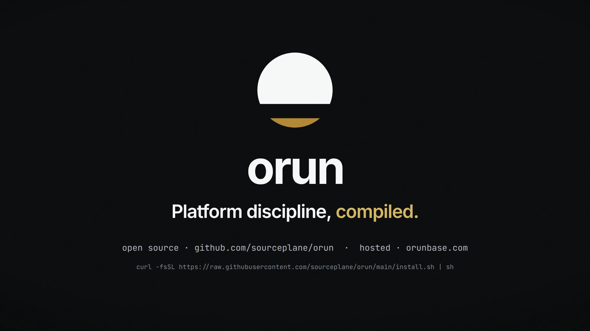

# orun launch film: "Above the line"



This is a 55.7-second launch film for `orun` and Orunbase. It is built from code and stays
true to the product. Every screen shows real output: `orun plan` run against this repo's
`examples/`, a real schema-policy failure, the real `lumen` catalog graph, and a real 41/41 CI
run from an Orunbase workspace.

- **Direction:** the amber horizon line from the Orunbase mark is the compiler. Intent lives
  above the line, and the platform exists below it. See [BRIEF.md](BRIEF.md) for the approved
  figures, the three directions and the two that were killed.
- **Script and storyboard:** [SCRIPT.md](SCRIPT.md). Captions: [orun-launch.en.srt](orun-launch.en.srt).
- **Craft discipline:** [product-launch-motion](https://github.com/AbubakrChan/product-launch-motion).
  Reveals are word-locked to a measured transcript, the build is deterministic, the audio is
  mastered to −14 LUFS / −1 dBTP, and QA was done on the delivered file.
- **Renderer:** [HyperFrames](https://github.com/heygen-com/hyperframes) 0.8.92. It is
  HTML + GSAP, seeked frame by frame in headless Chrome.
- **Voice:** Kokoro-82M (`af_heart`), local and open. Word timings come from faster-whisper
  `small.en`.
- **Sound:** every sound is synthesised in [`mix.py`](mix.py). There are no samples and no
  licences to track.
- **Type:** Inter and JetBrains Mono (OFL), vendored from `@fontsource`.
- **Colour:** the Orunbase tokens, verbatim from orunbase.com.

## Rebuild

```bash
npm install

# 1. voice + word timings (Python 3.11+, CPU is fine)
python -m venv venv && ./venv/bin/pip install kokoro-onnx soundfile faster-whisper
mkdir -p models voice
curl -L -o models/kokoro-v1.0.onnx  https://github.com/thewh1teagle/kokoro-onnx/releases/download/model-files-v1.0/kokoro-v1.0.onnx
curl -L -o models/voices-v1.0.bin   https://github.com/thewh1teagle/kokoro-onnx/releases/download/model-files-v1.0/voices-v1.0.bin
./venv/bin/python tts.py                              # voice/*.wav
./venv/bin/python words.py && mv audio_meta.json project/   # only if the script changed

# 2. picture: scene lengths are derived from the measured VO
node build.mjs                                        # project/index.html + timeline.json
npx hyperframes lint project && npx hyperframes validate project
npm run render                                        # renders/video-silent.mp4

# 3. sound: synthesise, mix, master to -14 LUFS / -1 dBTP
./venv/bin/python mix.py                              # prints a per-cue audibility audit
./master.sh                                           # master.wav + ebur128 readout
FF=node_modules/ffmpeg-static/ffmpeg
$FF -i renders/video-silent.mp4 -i master.wav -map 0:v -map 1:a \
  -c:v libx264 -preset slow -crf 20 -tune film -pix_fmt yuv420p \
  -c:a aac -b:a 192k -shortest -movflags +faststart renders/orun-launch.mp4
python3 captions.py                                   # orun-launch.en.srt
```

`project/audio_meta.json` is committed, so the picture can be rebuilt and previewed with
`npx hyperframes preview project` without running any TTS.

## Delivered v1

| | |
|---|---|
| Length | 55.73 s, 1920×1080, 30 fps, H.264 + AAC |
| Loudness | −14.2 LUFS integrated, −1.1 dBTP, measured on the delivered MP4 |
| Size | 36.6 MB |

## What I would fix next

- A vertical (1080×1920) re-layout for feeds. The composition is 16:9 only.
- A human voiceover. Kokoro is clean but audibly synthetic.
- Scene 5 holds about 1.5 s on the headline alone before the agent's change arrives. It could
  carry a faint preview of the guardrail.
- Once `orun plan` job ordering is made deterministic, scene 4 can show a matching plan
  checksum across the three runs, rather than just matching inputs and job sets.
