# Design: orun-state-redesign (Phase 1)

## 1. Problem

Orun's local state today is split across two unrelated top-level directories:

```
.orun/plans/{checksum}.json
.orun/executions/{exec-id}/...
```

There is no first-class link between *what triggered a plan*, *what was
compiled*, and *what was executed*. Trigger metadata is opt-in; ad-hoc local
plans have no trigger record at all. The layout cannot be cleanly mapped onto a
remote object store — paths are flat, names encode semantics, and there is no
abstraction in front of the filesystem.

Concrete pain points:

- `orun status` and `orun logs` resolve executions by scanning a flat
  directory. With hundreds of executions this is slow and brittle.
- Reproducing a CI run locally requires manually correlating a plan hash with
  an execution ID. The provenance is lost.
- Adding a remote backend would either force a parallel code path or a
  retrofitted abstraction.
- System-initiated runs (manual `orun plan`) and CI-triggered runs follow
  divergent code paths, making auditing inconsistent.

## 2. Goals

1. **Trigger totality.** Every compiled plan carries a `TriggerOccurrence` —
   declared (CI binding) or system (manual / changed / replay / api).
2. **Revision-first lineage.** A `PlanRevision` is the unit of storage,
   bundling trigger context, plan artifact, and all executions in one directory.
3. **Storage abstraction.** A `StateStore` interface mediates every new write.
   Phase 1 ships only a local-filesystem driver; the contract is engineered for
   R2/S3/Cloud later without changing callers.
4. **Remote-shaped paths.** Logical paths used by the store are valid as object
   keys; no path step depends on machine-local layout.
5. **Backward compatibility.** Existing CLI invocations and on-disk paths
   continue to work. Migration is additive and idempotent; no data is destroyed.
6. **Reviewable rollout.** The runner is not rewritten in this phase. A bridge
   writer mirrors legacy output into the new layout so the change is reversible.

## 3. Non-Goals (Phase 1)

- R2 / S3 / Orun Cloud drivers, SaaS auth, Supabase sync, Durable Objects.
- Replacing the existing runner's state-writing code path. The bridge exists
  so the change is additive.
- Designing the SaaS object-key layout (Phase 2 owns it).
- TUI changes (the cockpit spec consumes `StateStore` once Phase 1 lands).
- Deleting any legacy state.

## 4. Lineage

```
TriggerOccurrence
  └─ PlanRevision
      └─ ExecutionRun
          └─ JobRun
              └─ JobAttempt
                  └─ StepAttempt
```

Phase 1 introduces the first three levels as first-class persisted records.
JobRun/JobAttempt/StepAttempt directories are *reserved* in the layout but the
runner continues to write its existing `state.json` representation, mirrored by
the bridge. Phase 2/3 can take the runner native.

## 5. Architecture

```mermaid
graph TD
    subgraph CLI["cmd/orun"]
        CMDPLAN["command_plan.go"]
        CMDRUN["command_run.go"]
        CMDSTAT["command_status.go"]
        CMDLOGS["command_logs.go"]
        CMDDESC["command_describe.go"]
        CMDMIG["command_state_migrate.go (hidden)"]
    end

    subgraph TriggerCtx["internal/triggerctx"]
        TOR["resolve.go"]
        TSYS["system.go"]
        TDEC["declared.go (wraps internal/trigger)"]
        TIDS["ids.go (ULID + key helpers)"]
        TCTX["context.go (TriggerOccurrence)"]
    end

    subgraph Revision["internal/revision"]
        RMODEL["model.go (PlanRevision)"]
        RKEYS["keys.go (RevisionKey + collision)"]
        RWRITE["writer.go"]
        RMAN["manifest.go"]
        RRES["resolver.go"]
    end

    subgraph StateStore["internal/statestore"]
        SSIF["store.go (interface)"]
        SSLOCAL["local.go"]
        SSPATH["paths.go"]
        SSREFS["refs.go"]
        SSIDX["indexes.go"]
    end

    subgraph ExecState["internal/executionstate"]
        EMODEL["model.go (ExecutionRun)"]
        EWRITE["writer.go"]
        ERES["resolver.go"]
        EBR["bridge.go"]
    end

    subgraph Existing["existing packages (unchanged)"]
        TR["internal/trigger"]
        RUN["internal/runner"]
        ST["internal/state"]
        RB["internal/runbundle"]
    end

    CMDPLAN --> TOR --> TDEC --> TR
    CMDPLAN --> RWRITE --> SSIF
    RWRITE --> RMAN
    CMDRUN --> ERES --> SSIF
    CMDRUN --> EWRITE --> SSIF
    CMDRUN --> EBR --> RUN
    EBR --> ST
    CMDSTAT --> SSREFS
    CMDSTAT --> ERES
    CMDLOGS --> ERES
    CMDDESC --> RRES
    CMDMIG --> RWRITE
    CMDMIG --> EBR
    SSLOCAL --> SSIF
    SSPATH --> SSIF
    SSREFS --> SSIF
    SSIDX --> SSIF
    EWRITE --> RB
```



### 5.1 Package boundaries

| Package | Owns | Depends on |
|---------|------|-----------|
| `internal/triggerctx` | `TriggerOccurrence` model, declared+system resolvers, trigger key generation, ULID for `trg_*` | `internal/trigger`, stdlib, `github.com/oklog/ulid/v2` |
| `internal/revision` | `PlanRevision` model, revision key + collision, writer order, manifest, resolver | `internal/triggerctx`, `internal/statestore` |
| `internal/statestore` | `StateStore` interface, local driver, atomic writes, refs, indexes, path helpers | stdlib only |
| `internal/executionstate` | `ExecutionRun` model, execution writer, runner bridge, resolver | `internal/statestore`, `internal/revision`, `internal/runner` (read-only of its snapshot stream) |

`internal/runner`, `internal/state`, `internal/runbundle`, and CLI command
files are read or wrapped, never forked.

## 6. On-disk layout (canonical)

```
.orun/
  version.json

  refs/
    latest-revision.json
    latest-execution.json
    triggers/
      system.manual/latest.json
      system.manual-changed/latest.json
      github-pull-request/{latest.json, pr-139.json}
      github-push-main/{latest.json, branch-main.json}
    named/
      release-candidate.json

  indexes/
    revisions/{revisionKey}.json
    executions/{executionKey}.json

  revisions/
    rev-pr139-def456a-p8f31c09/
      manifest.json
      trigger.json
      revision.json
      plan.json
      executions/
        run-001/
          execution.json
          snapshot.latest.json
          state.json          # bridge-mirrored
          metadata.json       # bridge-mirrored
          jobs/
            j-a8f31c09/
              job-run.json
              attempts/1/{attempt.json, steps/s-*.json}
              logs/
          logs/
          events/000000001-execution-created.json
          artifacts/
```

Job folders are always `j-<shortHash(jobID)>` because plan job IDs may include
`@`, `.`, `/`. The original `jobId` is preserved in `job-run.json`. See
`data-model.md` for every schema.

## 7. Path-shape rule

The `StateStore` accepts logical paths rooted at the workspace state root:

```
revisions/<key>/plan.json
revisions/<key>/executions/<execKey>/execution.json
refs/latest-revision.json
indexes/executions/<execKey>.json
```

The local driver maps to OS separators rooted at `.orun/`. A future remote
driver maps to `orgs/<org>/projects/<project>/.orun/<logical>`. **No Phase 1
path may include a machine-local segment** — see `state-store.md`.

## 8. Compatibility model

| Workflow | Phase 1 behavior |
|----------|------------------|
| `orun plan -o /tmp/plan.json` | Unchanged; also writes revision-first layout. |
| `orun plan` (bare) | Writes revision-first **and** legacy `.orun/plans/{checksum}.json` + `latest.json` as compat aliases. |
| `orun run --plan /tmp/plan.json` | Materializes a `system.manual` revision in-memory, creates execution under it. |
| `orun run <hash>` | Resolves: file → revision key → named ref → legacy plan hash → component name. |
| `orun status` / `orun logs` / `orun describe` | Read from `refs/`; fall back to legacy `.orun/executions/` scan on miss. |
| `orun state migrate --dry-run` (hidden) | Reports planned mapping without writing. |
| `orun state migrate` (hidden) | Idempotently rehomes legacy state. Never deletes. |

A single internal flag `stateCompatibilityWrites bool` (default `true`) gates
the legacy writes; Phase 2 will flip it.

See `compatibility-and-migration.md` for details.

## 9. Correctness properties

1. **Trigger totality.** Every `revision.json` on disk has a sibling
   `trigger.json` in the same directory.
2. **Revision uniqueness.** Two distinct revisions either differ by key or
   share `(planHash, triggerKey)` (collision-suffix path).
3. **Execution containment.** Every `execution.json` is reachable from exactly
   one `revision.json` via `executions/<execKey>/`.
4. **Ref eventual freshness.** After a successful `WriteRevision` /
   `CreateExecution`, the corresponding `refs/latest-*.json` resolves to that
   key. A crash between the body write and the ref write is tolerated — the
   resolver falls back to a scan.
5. **Atomicity.** No reader observes a partially written JSON document.
6. **Migration idempotence.** Running `orun state migrate` twice produces the
   same revision and execution set.
7. **Compat invariants.** `orun plan -o`, `orun run --plan`, `orun run <hash>`,
   `orun status`, `orun logs` all succeed on a repo that has never been migrated.

Property-based tests (`rapid`) cover collision resolution, execution-key
monotonicity, and `StateStore.Write` atomicity under interleaved goroutines.
See `test-plan.md`.

## 10. Alternatives considered

### 10.1 Keep flat `.orun/plans` and `.orun/executions`, add a sidecar trigger file

Rejected. Sidecars would need a join index for every status query, and the
flat path shape still doesn't map to object stores. The pain we feel today
recurs at every layer.

### 10.2 Single SQLite file as state store

Rejected for Phase 1. SQLite would force a custom remote story (litestream or
custom replication), make individual records harder to inspect with shell
tools, and break the goal that any one revision folder is portable as a tarball.

### 10.3 Rewrite the runner in the same PR

Rejected. The runner is the highest-blast-radius component. Bridging is
cheaper than a coupled rewrite and lets us validate the layout against real
executions before the runner change lands.

### 10.4 Long encoded folder names that contain full provenance

Rejected. Filesystem path-length limits, illegible directory listings, and
brittleness if any field changes. The keys are short and stable; provenance
lives in JSON.

## 11. Risk register

| Risk | Likelihood | Impact | Mitigation |
|------|-----------|--------|------------|
| Bridge mirror desync silently corrupts `orun status` | Med | High | Single mirror entry point; failures emit structured event; status reader prefers revision-first but falls back to legacy. |
| Revision key collision on identical `(plan, scope, sha)` | Med | Med | `-xN` suffix, race-safe via `CreateIfAbsent`. |
| Perf regression on `.orun/` trees with thousands of revisions | Low | Med | Indexes + refs avoid full-tree scans for hot paths. |
| Concurrent `orun plan` from two shells corrupts a ref | Low | Med | Refs use CAS; loser retries. |
| Hardlink mirror fails on cross-device FS | Low | Low | Auto-fall-back to copy; logged. |
| Migration mis-attaches legacy executions | Med | Med | Hash-based match only; orphan bucket `rev-migrated-unknown-*`; dry-run mandatory by convention. |
| New layout invalidates existing `internal/runbundle` ExecID assumptions | Low | Med | Bridge preserves the GHA-style `gh-{run_id}-{attempt}-{sha}` ExecID as `executionKey`; runbundle code unchanged. |

## 12. Open questions

Tracked in `risks-and-open-questions.md`. Highlights:

- Should `orun state migrate` run automatically on first invocation of `orun
  plan` against a legacy `.orun/`? Default decision: **no** — manual only in
  Phase 1.
- Should refs/indexes be JSON or a more compact format (msgpack)? Default: JSON
  for inspectability; revisit if file count >10k.
- Should the bridge use hardlink or copy as default? Default: hardlink with
  copy fallback.

## 13. Dependency additions

| Module | Why |
|--------|-----|
| `github.com/oklog/ulid/v2` | Monotonic ULIDs for `triggerId` / `revisionId` / `executionId`. |

`pgregory.net/rapid` is already pinned per the TUI cockpit spec and
is reused here for property-based tests.

No other dependencies. All other functionality is stdlib.
